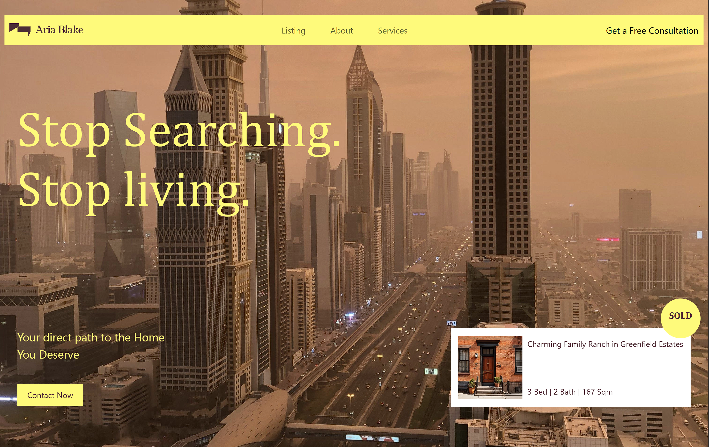
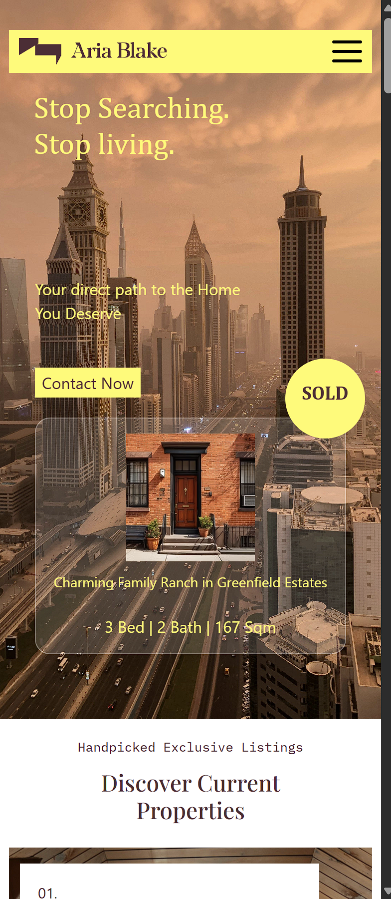

# Real Estate Landing Page Clone

A modern and fully responsive real estate landing page built using HTML5, CSS3, and Bootstrap 5. The project focuses on clean UI design, responsive layouts, accessibility improvements, and performance optimization.

## 🌐 Live Demo

**View Live Project**

https://syedabsar99.github.io/real-estate-landing-page/

---

## 📸 Preview

### Desktop View



### Mobile View



---

## 🚀 Features

* Fully responsive design
* Modern real estate landing page UI
* Fixed navigation bar
* Property showcase section
* Services and portfolio sections
* Testimonials section
* Appointment booking interface
* Hover animations and interactions
* Optimized image loading with lazy loading
* Improved accessibility with descriptive alt text

---

## 🛠️ Built With

* HTML5
* CSS3
* Bootstrap 5
* Flexbox
* CSS Grid
* Google Fonts
* Remix Icons

---

## 📂 Project Structure

```text
real-estate-landing-page
│
├── index.html
├── style.css
├── screenshots/
│   ├── desktop-preview.png
│   └── mobile-preview.png
│
└── README.md
```

---

## 🎯 Learning Outcomes

Through this project I practiced:

* Responsive web design
* Bootstrap layout system
* CSS Flexbox and Grid
* UI implementation from a design reference
* Performance optimization techniques
* Accessibility best practices
* Git and GitHub deployment workflow

---

## 🔗 Deployment

This project is deployed using GitHub Pages.

Live URL:

https://syedabsar99.github.io/real-estate-landing-page/

---

## 👨‍💻 Author

**Syed Noor Ul Absar**

GitHub: https://github.com/syedabsar99
